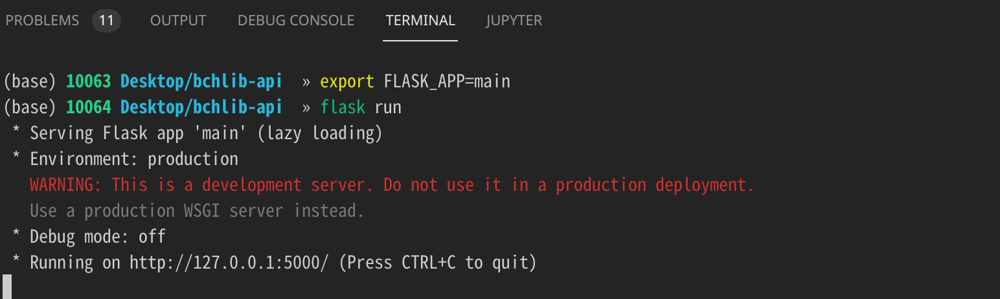
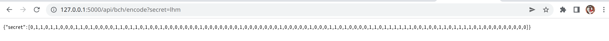
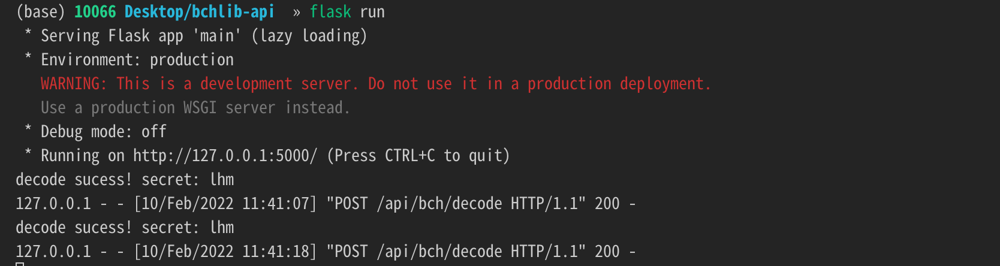

## bchlib python backend

### 1. Install flask


```python
%pip install Flask
```

### 2. Run Flaask app in *terminal*




```python
# Mac/Linux
export FLASK_APP=main       # add app file
flask run

# Win
set FLASK_APP = main          # add app file
flask run
```

### 3.Sent http request

#### encode
open URL in browser: [URL](http://127.0.0.1:5000/api/bch/encode?secret=lhm)


#### decode




```python
import requests

BASE_URL = 'http://127.0.0.1:5000/api/bch/'
URL = BASE_URL + 'decode'

r = requests.request('POST', URL,json={
    'code': [0,1,1,0,1,1,0,0,0,1,1,0,1,0,0,0,0,1,1,0,1,1,0,1,0,0,1,0,0,0,0,0,0,0,1,0,0,0,0,0,0,0,1,0,0,0,0,0,0,0,1,0,0,0,0,0,1,0,0,0,1,1,0,1,0,0,0,0,1,1,0,1,1,1,1,1,1,0,0,1,0,0,1,1,0,1,1,1,1,0,1,0,0,0,0,0,0,0,0,0]
})
print(r.content)
```
> b'{"secret":"lhm    "}\n'

## Flutter http request
[Package doi](https://pub.dev/packages/dio) : A powerful Http client for Dart, which supports Interceptors, Global configuration, FormData, Request Cancellation, File downloading, Timeout etc.
